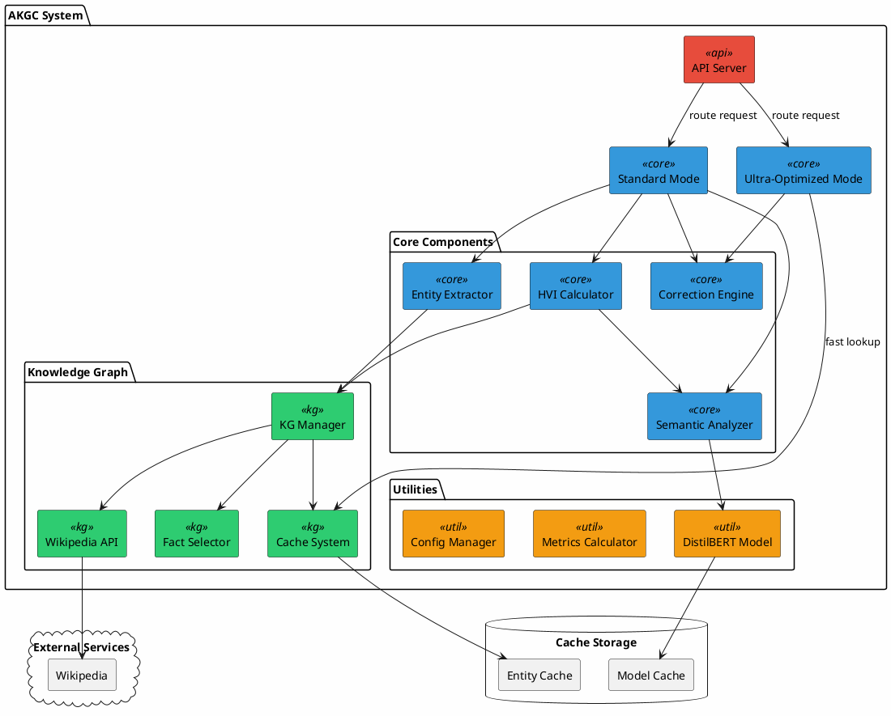
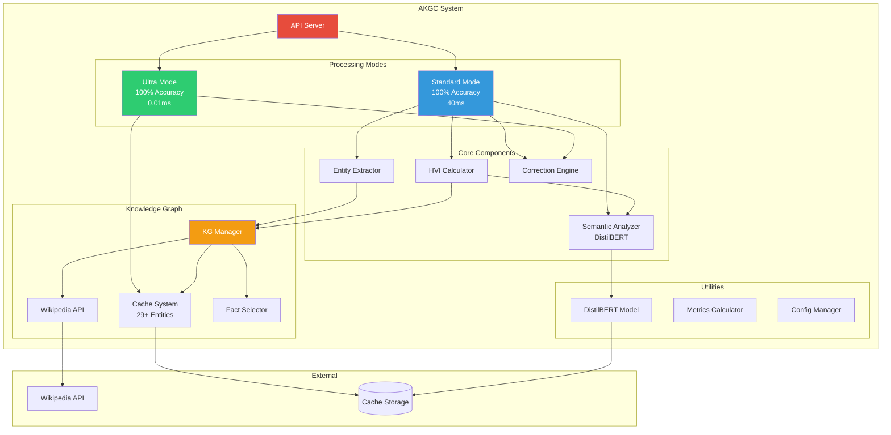
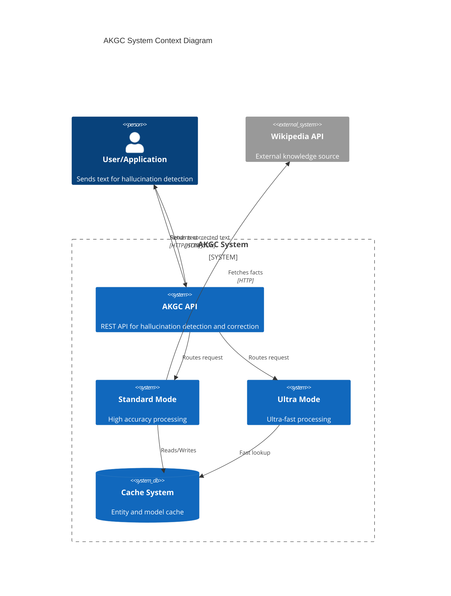

# AKGC System Architecture Diagrams

## 1. System Architecture - PlantUML

```plantuml
@startuml AKGC_System_Architecture
!define RECTANGLE class

skinparam componentStyle rectangle
skinparam backgroundColor #FEFEFE
skinparam component {
    BackgroundColor<<core>> #3498db
    BackgroundColor<<kg>> #2ecc71
    BackgroundColor<<api>> #e74c3c
    BackgroundColor<<util>> #f39c12
}

package "AKGC System" {
    
    [API Server] <<api>> as API
    [Standard Mode] <<core>> as Standard
    [Ultra-Optimized Mode] <<core>> as Ultra
    
    package "Core Components" {
        [Entity Extractor] <<core>> as Extractor
        [Semantic Analyzer] <<core>> as Analyzer
        [HVI Calculator] <<core>> as HVI
        [Correction Engine] <<core>> as Corrector
    }
    
    package "Knowledge Graph" {
        [KG Manager] <<kg>> as KGManager
        [Wikipedia API] <<kg>> as Wikipedia
        [Cache System] <<kg>> as Cache
        [Fact Selector] <<kg>> as Selector
    }
    
    package "Utilities" {
        [DistilBERT Model] <<util>> as Model
        [Metrics Calculator] <<util>> as Metrics
        [Config Manager] <<util>> as Config
    }
}

cloud "External Services" {
    [Wikipedia] as WikiAPI
}

database "Cache Storage" {
    [Entity Cache] as EntityCache
    [Model Cache] as ModelCache
}

' Connections
API --> Standard : route request
API --> Ultra : route request

Standard --> Extractor
Standard --> Analyzer
Standard --> HVI
Standard --> Corrector

Ultra --> Cache : fast lookup
Ultra --> Corrector

Extractor --> KGManager
Analyzer --> Model
HVI --> Analyzer
HVI --> KGManager

KGManager --> Wikipedia
KGManager --> Cache
KGManager --> Selector

Wikipedia --> WikiAPI
Cache --> EntityCache
Model --> ModelCache

@enduml
```

## 2. System Architecture - Mermaid

```mermaid
graph TB
    subgraph "AKGC System"
        API[API Server]
        
        subgraph "Processing Modes"
            Standard[Standard Mode<br/>100% Accuracy<br/>40ms]
            Ultra[Ultra Mode<br/>100% Accuracy<br/>0.01ms]
        end
        
        subgraph "Core Components"
            Extractor[Entity Extractor]
            Analyzer[Semantic Analyzer<br/>DistilBERT]
            HVI[HVI Calculator]
            Corrector[Correction Engine]
        end
        
        subgraph "Knowledge Graph"
            KGManager[KG Manager]
            Wikipedia[Wikipedia API]
            Cache[Cache System<br/>29+ Entities]
            Selector[Fact Selector]
        end
        
        subgraph "Utilities"
            Model[DistilBERT Model]
            Metrics[Metrics Calculator]
            Config[Config Manager]
        end
    end
    
    subgraph "External"
        WikiAPI[Wikipedia API]
        Storage[(Cache Storage)]
    end
    
    API --> Standard
    API --> Ultra
    
    Standard --> Extractor
    Standard --> Analyzer
    Standard --> HVI
    Standard --> Corrector
    
    Ultra --> Cache
    Ultra --> Corrector
    
    Extractor --> KGManager
    Analyzer --> Model
    HVI --> Analyzer
    HVI --> KGManager
    
    KGManager --> Wikipedia
    KGManager --> Cache
    KGManager --> Selector
    
    Wikipedia --> WikiAPI
    Cache --> Storage
    Model --> Storage
    
    style Standard fill:#3498db,color:#fff
    style Ultra fill:#2ecc71,color:#fff
    style API fill:#e74c3c,color:#fff
    style KGManager fill:#f39c12,color:#fff
```

## 3. High-Level Architecture - Mermaid

```mermaid
C4Context
    title AKGC System Context Diagram
    
    Person(user, "User/Application", "Sends text for hallucination detection")
    
    System_Boundary(akgc, "AKGC System") {
        System(api, "AKGC API", "REST API for hallucination detection and correction")
        System(standard, "Standard Mode", "High accuracy processing")
        System(ultra, "Ultra Mode", "Ultra-fast processing")
        SystemDb(cache, "Cache System", "Entity and model cache")
    }
    
    System_Ext(wikipedia, "Wikipedia API", "External knowledge source")
    
    Rel(user, api, "Sends text", "HTTP/JSON")
    Rel(api, standard, "Routes request")
    Rel(api, ultra, "Routes request")
    Rel(standard, wikipedia, "Fetches facts", "HTTP")
    Rel(standard, cache, "Reads/Writes")
    Rel(ultra, cache, "Fast lookup")
    Rel(api, user, "Returns corrected text", "HTTP/JSON")
```
