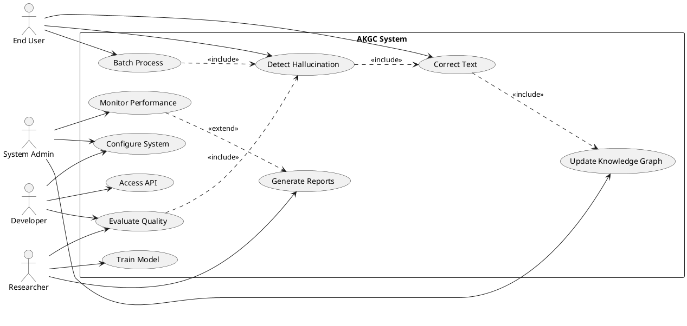
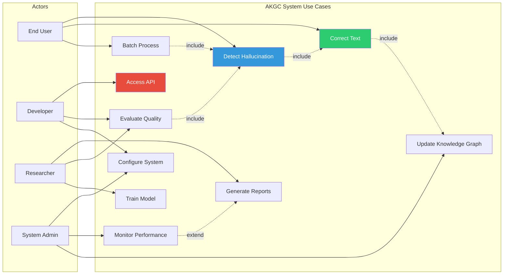
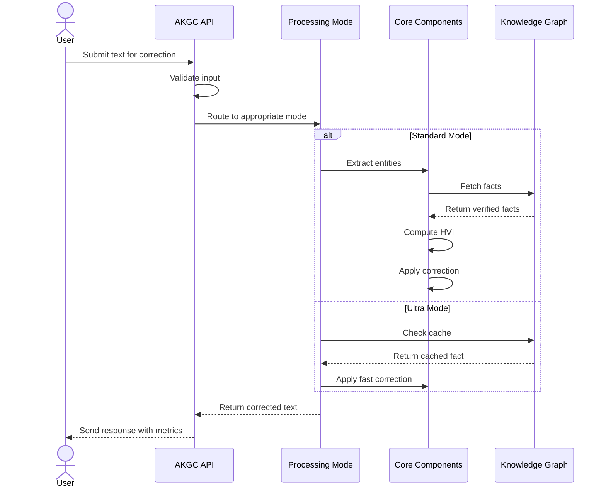

# AKGC Use Case Diagrams

## 1. Use Case Diagram - PlantUML

```plantuml
@startuml AKGC_Use_Cases
left to right direction
skinparam packageStyle rectangle

actor "End User" as User
actor "Developer" as Dev
actor "Researcher" as Researcher
actor "System Admin" as Admin

rectangle "AKGC System" {
    usecase "Detect Hallucination" as UC1
    usecase "Correct Text" as UC2
    usecase "Batch Process" as UC3
    usecase "Evaluate Quality" as UC4
    usecase "Configure System" as UC5
    usecase "Monitor Performance" as UC6
    usecase "Generate Reports" as UC7
    usecase "Access API" as UC8
    usecase "Train Model" as UC9
    usecase "Update Knowledge Graph" as UC10
}

' User interactions
User --> UC1
User --> UC2
User --> UC3

' Developer interactions
Dev --> UC8
Dev --> UC4
Dev --> UC5

' Researcher interactions
Researcher --> UC7
Researcher --> UC4
Researcher --> UC9

' Admin interactions
Admin --> UC5
Admin --> UC6
Admin --> UC10

' Use case relationships
UC1 ..> UC2 : <<include>>
UC2 ..> UC10 : <<include>>
UC3 ..> UC1 : <<include>>
UC4 ..> UC1 : <<include>>
UC6 ..> UC7 : <<extend>>

@enduml
```

## 2. Use Case Diagram - Mermaid

```mermaid
graph LR
    subgraph Actors
        User[End User]
        Dev[Developer]
        Researcher[Researcher]
        Admin[System Admin]
    end
    
    subgraph "AKGC System Use Cases"
        UC1[Detect Hallucination]
        UC2[Correct Text]
        UC3[Batch Process]
        UC4[Evaluate Quality]
        UC5[Configure System]
        UC6[Monitor Performance]
        UC7[Generate Reports]
        UC8[Access API]
        UC9[Train Model]
        UC10[Update Knowledge Graph]
    end
    
    User --> UC1
    User --> UC2
    User --> UC3
    
    Dev --> UC8
    Dev --> UC4
    Dev --> UC5
    
    Researcher --> UC7
    Researcher --> UC4
    Researcher --> UC9
    
    Admin --> UC5
    Admin --> UC6
    Admin --> UC10
    
    UC1 -.->|include| UC2
    UC2 -.->|include| UC10
    UC3 -.->|include| UC1
    UC4 -.->|include| UC1
    UC6 -.->|extend| UC7
    
    style UC1 fill:#3498db,color:#fff
    style UC2 fill:#2ecc71,color:#fff
    style UC8 fill:#e74c3c,color:#fff
```

## 3. Detailed Use Case: Text Correction

```mermaid
sequenceDiagram
    actor User
    participant API as AKGC API
    participant Mode as Processing Mode
    participant Core as Core Components
    participant KG as Knowledge Graph
    
    User->>API: Submit text for correction
    API->>API: Validate input
    API->>Mode: Route to appropriate mode
    
    alt Standard Mode
        Mode->>Core: Extract entities
        Core->>KG: Fetch facts
        KG-->>Core: Return verified facts
        Core->>Core: Compute HVI
        Core->>Core: Apply correction
    else Ultra Mode
        Mode->>KG: Check cache
        KG-->>Mode: Return cached fact
        Mode->>Core: Apply fast correction
    end
    
    Mode-->>API: Return corrected text
    API-->>User: Send response with metrics
```
