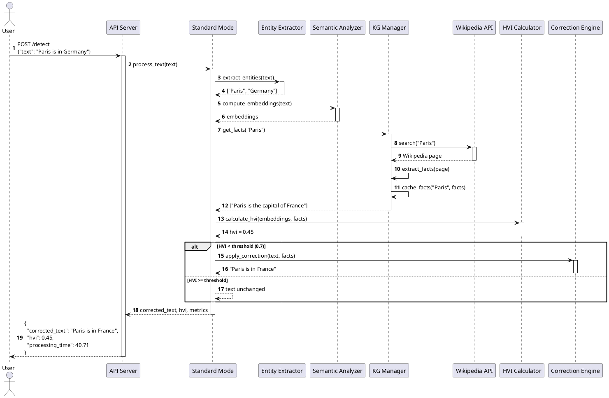
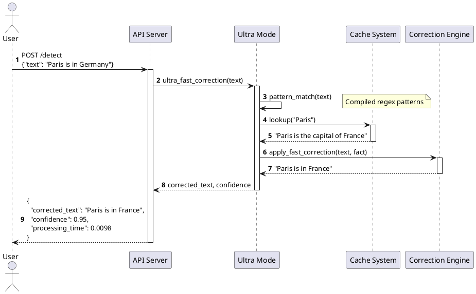
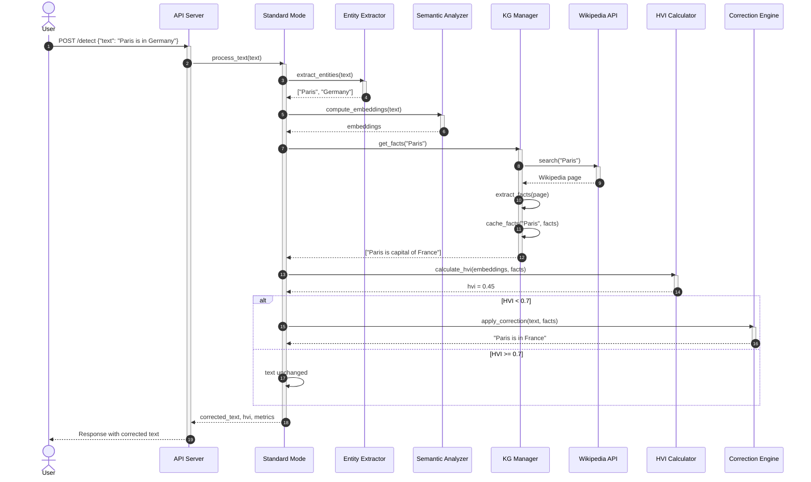
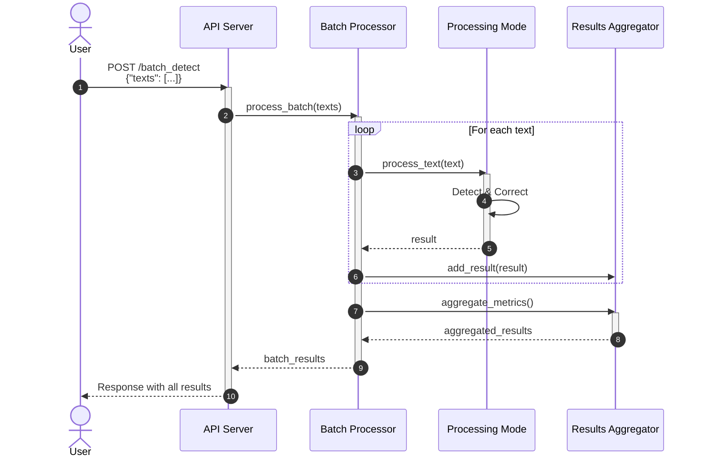

# AKGC Sequence Diagrams

## 1. Standard Mode Processing - PlantUML

```plantuml
@startuml AKGC_Standard_Sequence
autonumber
actor User
participant "API Server" as API
participant "Standard Mode" as Standard
participant "Entity Extractor" as Extractor
participant "Semantic Analyzer" as Analyzer
participant "KG Manager" as KG
participant "Wikipedia API" as Wiki
participant "HVI Calculator" as HVI
participant "Correction Engine" as Corrector

User -> API: POST /detect\n{"text": "Paris is in Germany"}
activate API

API -> Standard: process_text(text)
activate Standard

Standard -> Extractor: extract_entities(text)
activate Extractor
Extractor --> Standard: ["Paris", "Germany"]
deactivate Extractor

Standard -> Analyzer: compute_embeddings(text)
activate Analyzer
Analyzer --> Standard: embeddings
deactivate Analyzer

Standard -> KG: get_facts("Paris")
activate KG

KG -> Wiki: search("Paris")
activate Wiki
Wiki --> KG: Wikipedia page
deactivate Wiki

KG -> KG: extract_facts(page)
KG -> KG: cache_facts("Paris", facts)
KG --> Standard: ["Paris is the capital of France"]
deactivate KG

Standard -> HVI: calculate_hvi(embeddings, facts)
activate HVI
HVI --> Standard: hvi = 0.45
deactivate HVI

alt HVI < threshold (0.7)
    Standard -> Corrector: apply_correction(text, facts)
    activate Corrector
    Corrector --> Standard: "Paris is in France"
    deactivate Corrector
else HVI >= threshold
    Standard --> Standard: text unchanged
end

Standard --> API: corrected_text, hvi, metrics
deactivate Standard

API --> User: {\n  "corrected_text": "Paris is in France",\n  "hvi": 0.45,\n  "processing_time": 40.71\n}
deactivate API

@enduml
```

## 2. Ultra-Optimized Mode - PlantUML

```plantuml
@startuml AKGC_Ultra_Sequence
autonumber
actor User
participant "API Server" as API
participant "Ultra Mode" as Ultra
participant "Cache System" as Cache
participant "Correction Engine" as Corrector

User -> API: POST /detect\n{"text": "Paris is in Germany"}
activate API

API -> Ultra: ultra_fast_correction(text)
activate Ultra

Ultra -> Ultra: pattern_match(text)
note right: Compiled regex patterns

Ultra -> Cache: lookup("Paris")
activate Cache
Cache --> Ultra: "Paris is the capital of France"
deactivate Cache

Ultra -> Corrector: apply_fast_correction(text, fact)
activate Corrector
Corrector --> Ultra: "Paris is in France"
deactivate Corrector

Ultra --> API: corrected_text, confidence
deactivate Ultra

API --> User: {\n  "corrected_text": "Paris is in France",\n  "confidence": 0.95,\n  "processing_time": 0.0098\n}
deactivate API

@enduml
```

## 3. Standard Mode - Mermaid

```mermaid
sequenceDiagram
    autonumber
    actor User
    participant API as API Server
    participant Standard as Standard Mode
    participant Extractor as Entity Extractor
    participant Analyzer as Semantic Analyzer
    participant KG as KG Manager
    participant Wiki as Wikipedia API
    participant HVI as HVI Calculator
    participant Corrector as Correction Engine
    
    User->>API: POST /detect {"text": "Paris is in Germany"}
    activate API
    
    API->>Standard: process_text(text)
    activate Standard
    
    Standard->>Extractor: extract_entities(text)
    activate Extractor
    Extractor-->>Standard: ["Paris", "Germany"]
    deactivate Extractor
    
    Standard->>Analyzer: compute_embeddings(text)
    activate Analyzer
    Analyzer-->>Standard: embeddings
    deactivate Analyzer
    
    Standard->>KG: get_facts("Paris")
    activate KG
    
    KG->>Wiki: search("Paris")
    activate Wiki
    Wiki-->>KG: Wikipedia page
    deactivate Wiki
    
    KG->>KG: extract_facts(page)
    KG->>KG: cache_facts("Paris", facts)
    KG-->>Standard: ["Paris is capital of France"]
    deactivate KG
    
    Standard->>HVI: calculate_hvi(embeddings, facts)
    activate HVI
    HVI-->>Standard: hvi = 0.45
    deactivate HVI
    
    alt HVI < 0.7
        Standard->>Corrector: apply_correction(text, facts)
        activate Corrector
        Corrector-->>Standard: "Paris is in France"
        deactivate Corrector
    else HVI >= 0.7
        Standard->>Standard: text unchanged
    end
    
    Standard-->>API: corrected_text, hvi, metrics
    deactivate Standard
    
    API-->>User: Response with corrected text
    deactivate API
```

## 4. Batch Processing - Mermaid

```mermaid
sequenceDiagram
    autonumber
    actor User
    participant API as API Server
    participant Batch as Batch Processor
    participant Mode as Processing Mode
    participant Results as Results Aggregator
    
    User->>API: POST /batch_detect<br/>{"texts": [...]}
    activate API
    
    API->>Batch: process_batch(texts)
    activate Batch
    
    loop For each text
        Batch->>Mode: process_text(text)
        activate Mode
        Mode->>Mode: Detect & Correct
        Mode-->>Batch: result
        deactivate Mode
        Batch->>Results: add_result(result)
    end
    
    Batch->>Results: aggregate_metrics()
    activate Results
    Results-->>Batch: aggregated_results
    deactivate Results
    
    Batch-->>API: batch_results
    deactivate Batch
    
    API-->>User: Response with all results
    deactivate API
```
