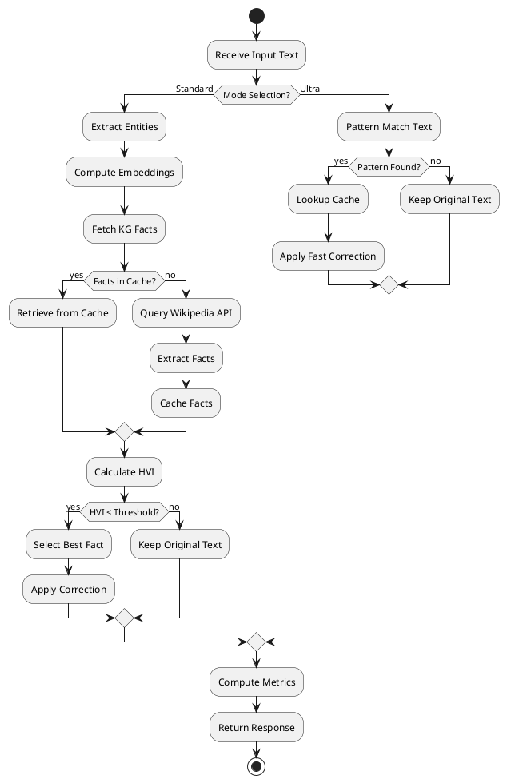
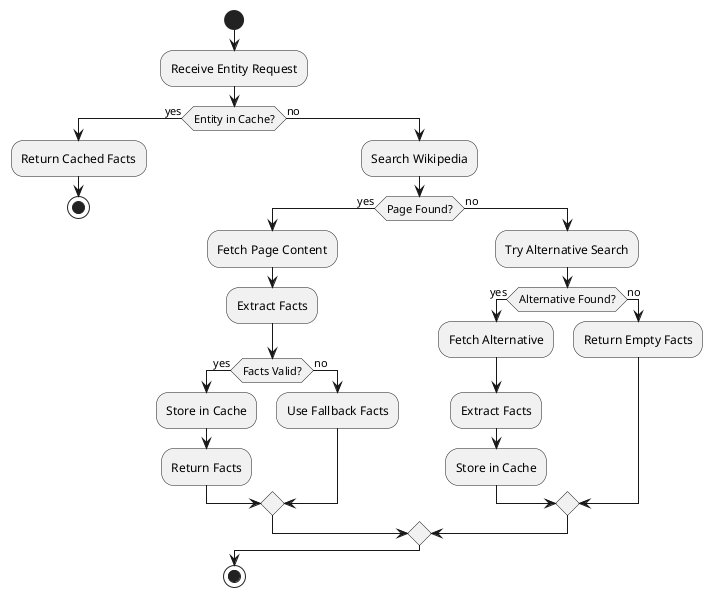
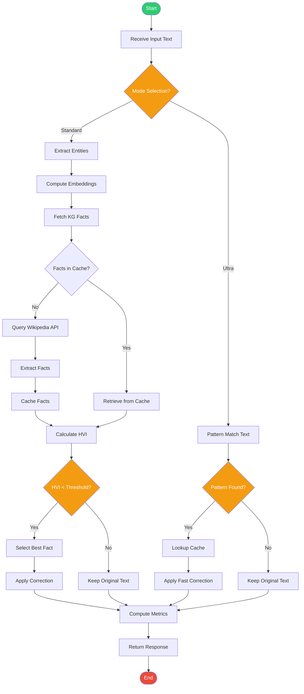
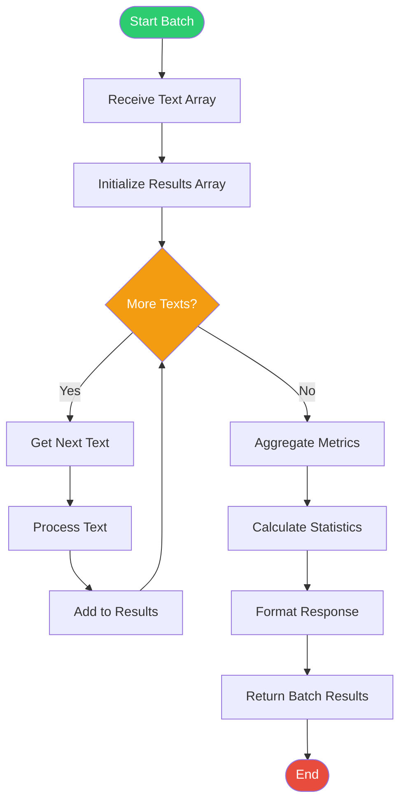
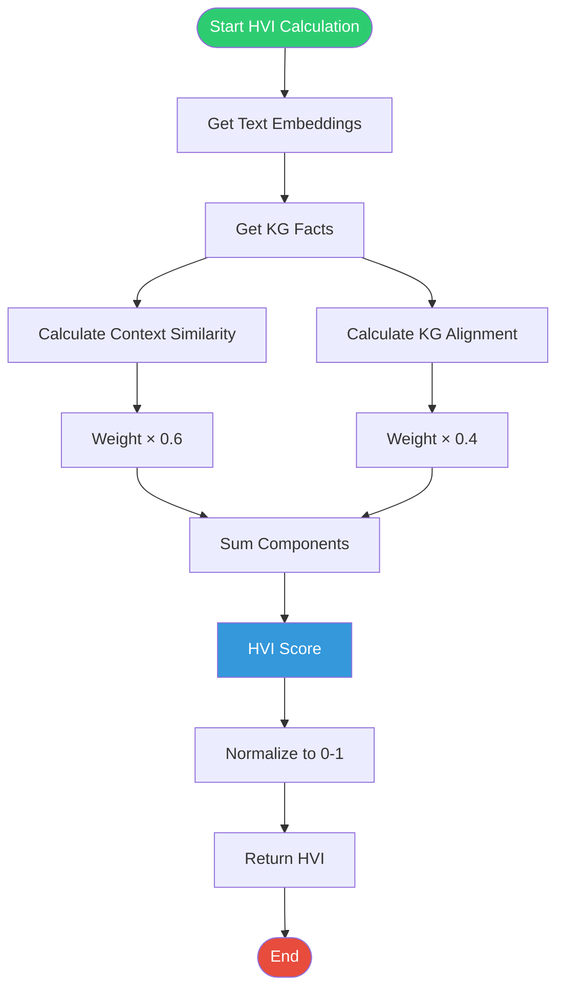

# AKGC Activity Diagrams

## 1. Text Correction Flow - PlantUML

## 2. Knowledge Graph Update - PlantUML

## 3. Text Correction Flow - Mermaid

## 4. Batch Processing Flow - Mermaid

## 5. HVI Calculation - Mermaid

