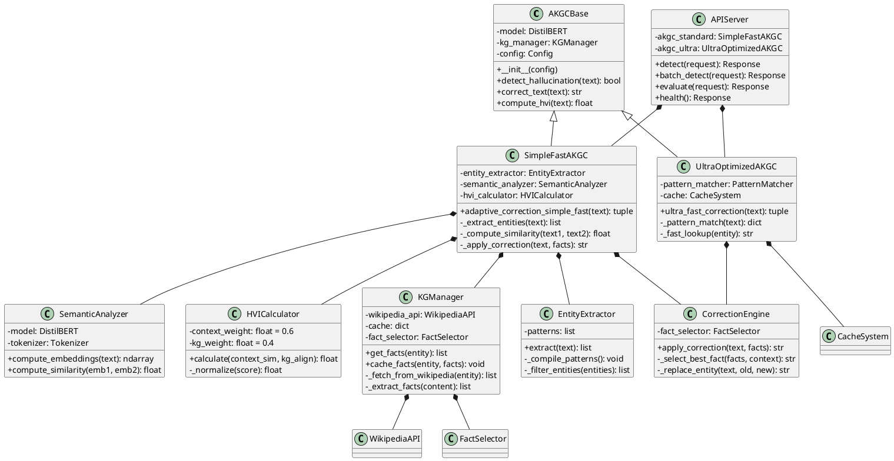
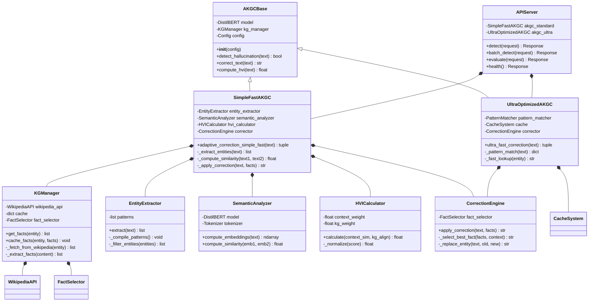
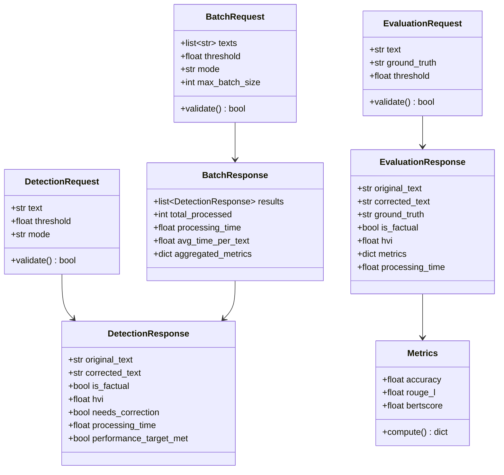

# AKGC Class Diagrams

## 1. Core Classes - PlantUML

```plantuml
@startuml AKGC_Class_Diagram
skinparam classAttributeIconSize 0

class AKGCBase {
    - model: DistilBERT
    - kg_manager: KGManager
    - config: Config
    + __init__(config)
    + detect_hallucination(text): bool
    + correct_text(text): str
    + compute_hvi(text): float
}

class SimpleFastAKGC {
    - entity_extractor: EntityExtractor
    - semantic_analyzer: SemanticAnalyzer
    - hvi_calculator: HVICalculator
    + adaptive_correction_simple_fast(text): tuple
    - _extract_entities(text): list
    - _compute_similarity(text1, text2): float
    - _apply_correction(text, facts): str
}

class UltraOptimizedAKGC {
    - pattern_matcher: PatternMatcher
    - cache: CacheSystem
    + ultra_fast_correction(text): tuple
    - _pattern_match(text): dict
    - _fast_lookup(entity): str
}

class KGManager {
    - wikipedia_api: WikipediaAPI
    - cache: dict
    - fact_selector: FactSelector
    + get_facts(entity): list
    + cache_facts(entity, facts): void
    - _fetch_from_wikipedia(entity): list
    - _extract_facts(content): list
}

class EntityExtractor {
    - patterns: list
    + extract(text): list
    - _compile_patterns(): void
    - _filter_entities(entities): list
}

class SemanticAnalyzer {
    - model: DistilBERT
    - tokenizer: Tokenizer
    + compute_embeddings(text): ndarray
    + compute_similarity(emb1, emb2): float
}

class HVICalculator {
    - context_weight: float = 0.6
    - kg_weight: float = 0.4
    + calculate(context_sim, kg_align): float
    - _normalize(score): float
}

class CorrectionEngine {
    - fact_selector: FactSelector
    + apply_correction(text, facts): str
    - _select_best_fact(facts, context): str
    - _replace_entity(text, old, new): str
}

class APIServer {
    - akgc_standard: SimpleFastAKGC
    - akgc_ultra: UltraOptimizedAKGC
    + detect(request): Response
    + batch_detect(request): Response
    + evaluate(request): Response
    + health(): Response
}

' Inheritance
AKGCBase <|-- SimpleFastAKGC
AKGCBase <|-- UltraOptimizedAKGC

' Composition
SimpleFastAKGC *-- EntityExtractor
SimpleFastAKGC *-- SemanticAnalyzer
SimpleFastAKGC *-- HVICalculator
SimpleFastAKGC *-- CorrectionEngine
SimpleFastAKGC *-- KGManager

UltraOptimizedAKGC *-- CacheSystem
UltraOptimizedAKGC *-- CorrectionEngine

APIServer *-- SimpleFastAKGC
APIServer *-- UltraOptimizedAKGC

KGManager *-- WikipediaAPI
KGManager *-- FactSelector

@enduml
```

## 2. Class Diagram - Mermaid

```mermaid
classDiagram
    class AKGCBase {
        -DistilBERT model
        -KGManager kg_manager
        -Config config
        +__init__(config)
        +detect_hallucination(text) bool
        +correct_text(text) str
        +compute_hvi(text) float
    }
    
    class SimpleFastAKGC {
        -EntityExtractor entity_extractor
        -SemanticAnalyzer semantic_analyzer
        -HVICalculator hvi_calculator
        -CorrectionEngine corrector
        +adaptive_correction_simple_fast(text) tuple
        -_extract_entities(text) list
        -_compute_similarity(text1, text2) float
        -_apply_correction(text, facts) str
    }
    
    class UltraOptimizedAKGC {
        -PatternMatcher pattern_matcher
        -CacheSystem cache
        -CorrectionEngine corrector
        +ultra_fast_correction(text) tuple
        -_pattern_match(text) dict
        -_fast_lookup(entity) str
    }
    
    class KGManager {
        -WikipediaAPI wikipedia_api
        -dict cache
        -FactSelector fact_selector
        +get_facts(entity) list
        +cache_facts(entity, facts) void
        -_fetch_from_wikipedia(entity) list
        -_extract_facts(content) list
    }
    
    class EntityExtractor {
        -list patterns
        +extract(text) list
        -_compile_patterns() void
        -_filter_entities(entities) list
    }
    
    class SemanticAnalyzer {
        -DistilBERT model
        -Tokenizer tokenizer
        +compute_embeddings(text) ndarray
        +compute_similarity(emb1, emb2) float
    }
    
    class HVICalculator {
        -float context_weight
        -float kg_weight
        +calculate(context_sim, kg_align) float
        -_normalize(score) float
    }
    
    class CorrectionEngine {
        -FactSelector fact_selector
        +apply_correction(text, facts) str
        -_select_best_fact(facts, context) str
        -_replace_entity(text, old, new) str
    }
    
    class APIServer {
        -SimpleFastAKGC akgc_standard
        -UltraOptimizedAKGC akgc_ultra
        +detect(request) Response
        +batch_detect(request) Response
        +evaluate(request) Response
        +health() Response
    }
    
    AKGCBase <|-- SimpleFastAKGC
    AKGCBase <|-- UltraOptimizedAKGC
    
    SimpleFastAKGC *-- EntityExtractor
    SimpleFastAKGC *-- SemanticAnalyzer
    SimpleFastAKGC *-- HVICalculator
    SimpleFastAKGC *-- CorrectionEngine
    SimpleFastAKGC *-- KGManager
    
    UltraOptimizedAKGC *-- CacheSystem
    UltraOptimizedAKGC *-- CorrectionEngine
    
    APIServer *-- SimpleFastAKGC
    APIServer *-- UltraOptimizedAKGC
    
    KGManager *-- WikipediaAPI
    KGManager *-- FactSelector
```

## 3. Data Models - Mermaid

```mermaid
classDiagram
    class DetectionRequest {
        +str text
        +float threshold
        +str mode
        +validate() bool
    }
    
    class DetectionResponse {
        +str original_text
        +str corrected_text
        +bool is_factual
        +float hvi
        +bool needs_correction
        +float processing_time
        +bool performance_target_met
    }
    
    class BatchRequest {
        +list~str~ texts
        +float threshold
        +str mode
        +int max_batch_size
        +validate() bool
    }
    
    class BatchResponse {
        +list~DetectionResponse~ results
        +int total_processed
        +float processing_time
        +float avg_time_per_text
        +dict aggregated_metrics
    }
    
    class EvaluationRequest {
        +str text
        +str ground_truth
        +float threshold
        +validate() bool
    }
    
    class EvaluationResponse {
        +str original_text
        +str corrected_text
        +str ground_truth
        +bool is_factual
        +float hvi
        +dict metrics
        +float processing_time
    }
    
    class Metrics {
        +float accuracy
        +float rouge_l
        +float bertscore
        +compute() dict
    }
    
    DetectionRequest --> DetectionResponse
    BatchRequest --> BatchResponse
    EvaluationRequest --> EvaluationResponse
    EvaluationResponse --> Metrics
    BatchResponse --> DetectionResponse
```
