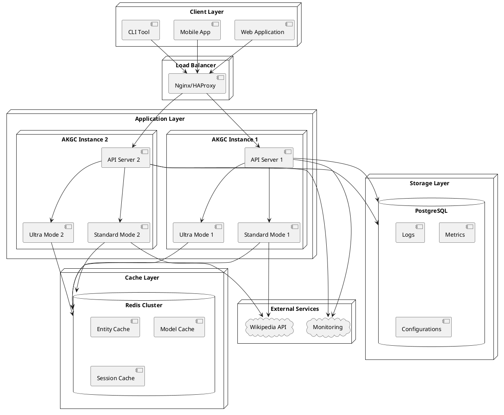
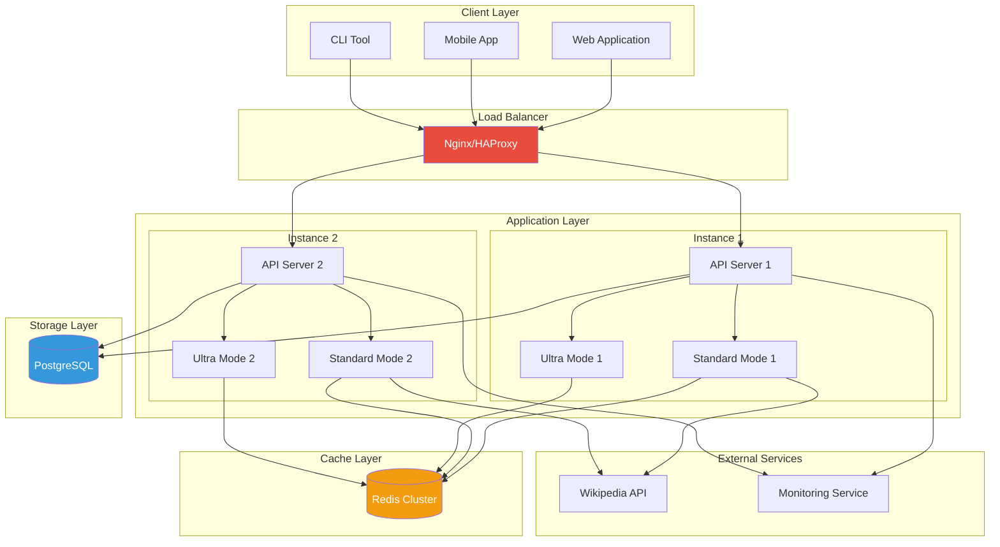
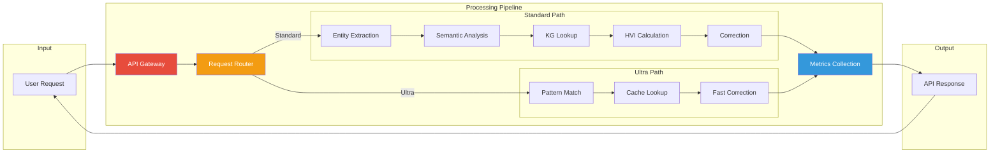
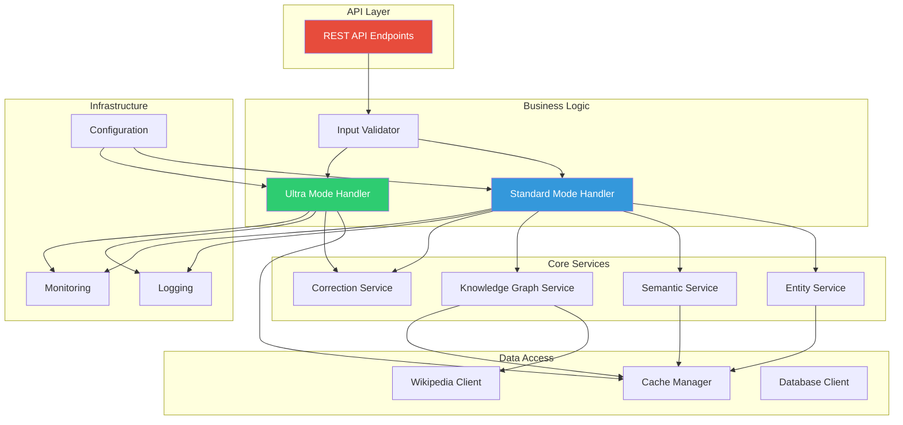
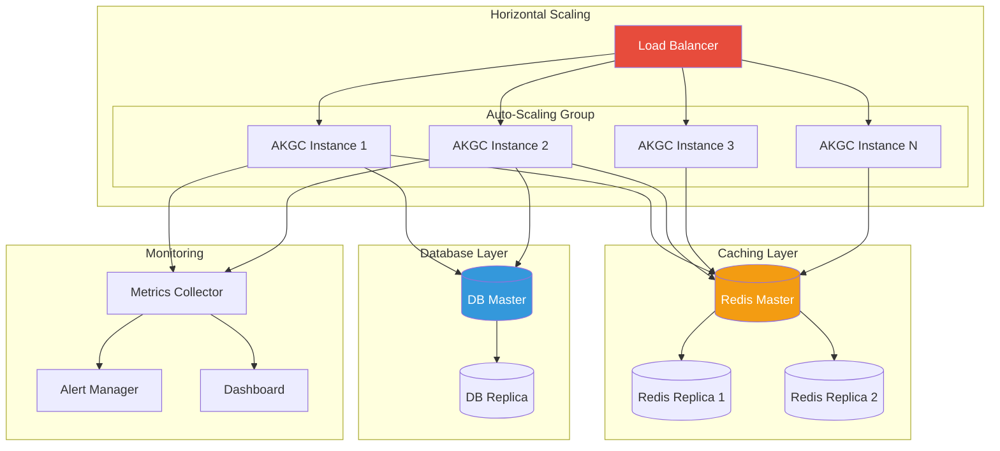

# AKGC System Design Diagrams

## 1. Deployment Architecture - PlantUML

## 2. Deployment Architecture - Mermaid

## 3. Data Flow Architecture - Mermaid

## 4. Component Interaction - Mermaid

## 5. Scalability Architecture - Mermaid

