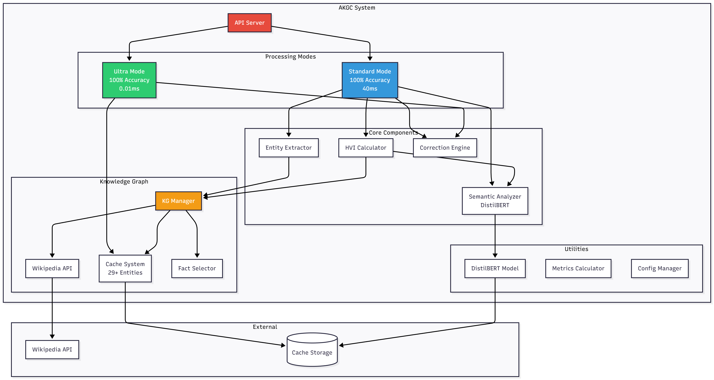
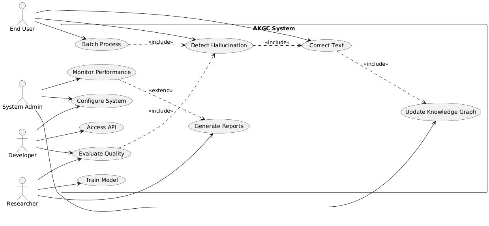
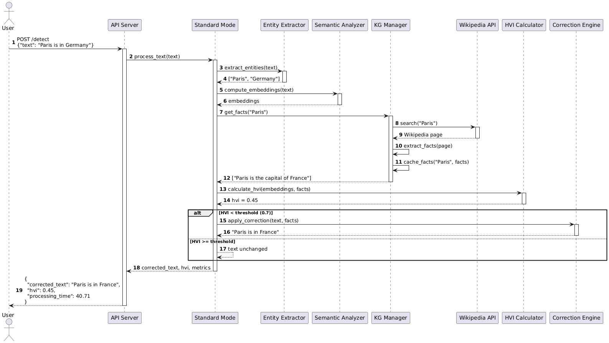
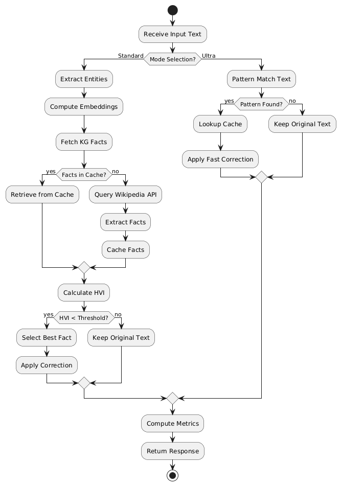
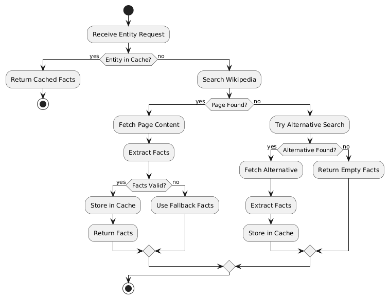
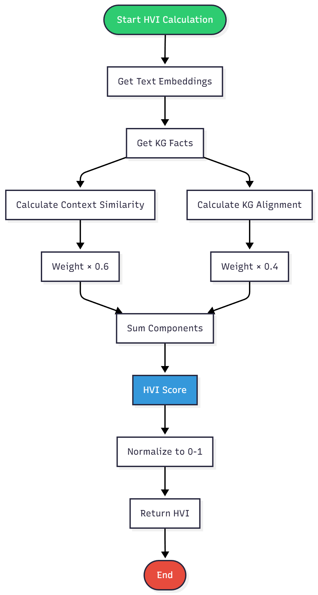
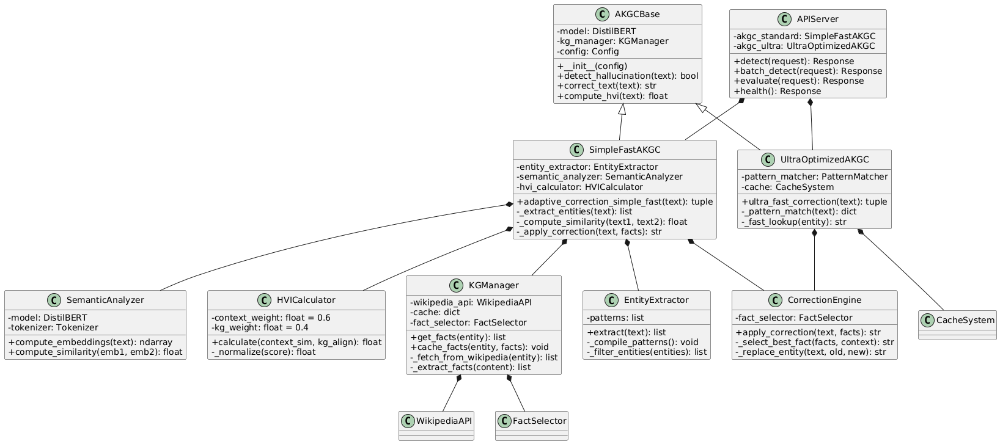
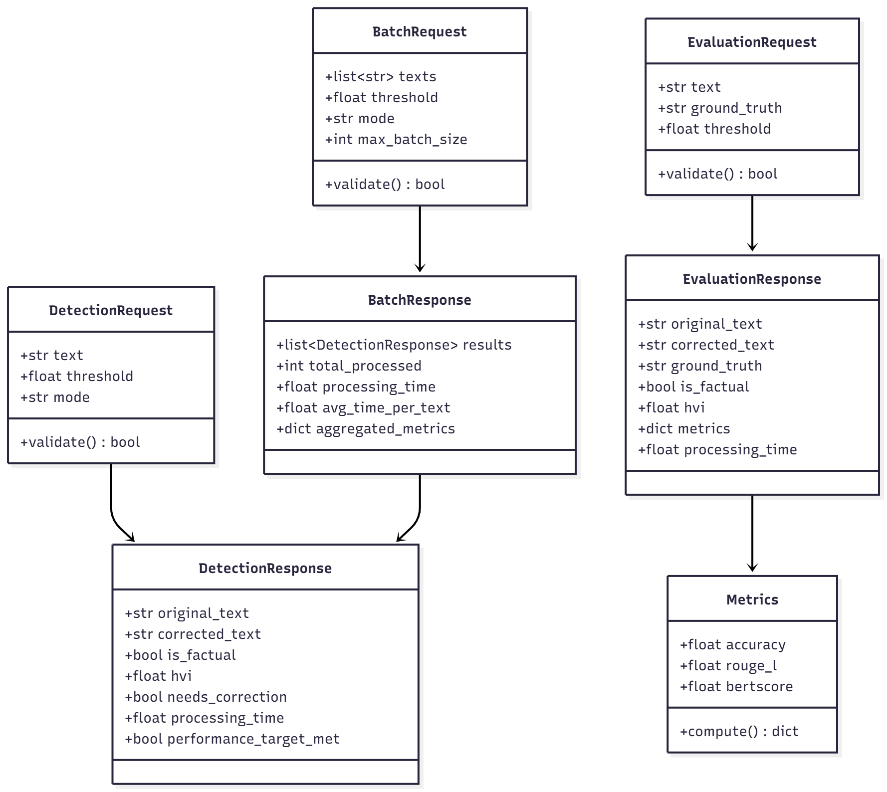
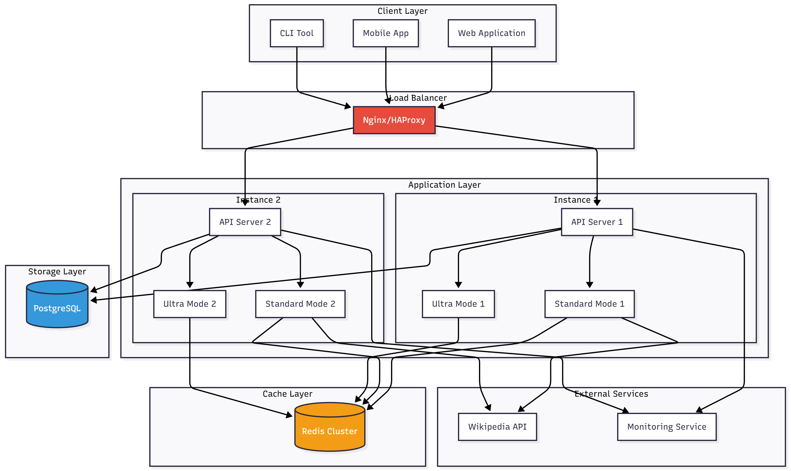

# AKGC Diagrams - Complete Index

## 📊 All Available Diagrams

This index lists all diagrams with both source code (PlantUML/Mermaid) and rendered PNG images.

---

## 1️⃣ System Architecture

### 📄 Source Code
- **File**: [01_system_architecture.md](01_system_architecture.md)
- **Formats**: PlantUML, Mermaid, C4 Context
- **Diagrams**: 3 total

### 🖼️ Rendered Images
- **File**: `01_system_architecture.png`
- **Shows**: Complete AKGC system with all components, layers, and connections



---

## 2️⃣ Use Case Diagrams

### 📄 Source Code
- **File**: [02_use_case.md](02_use_case.md)
- **Formats**: PlantUML, Mermaid
- **Diagrams**: 3 total

### 🖼️ Rendered Images
- **File**: `02_use_case_diagram.png`
- **Shows**: Actors (User, Developer, Researcher, Admin) and their interactions



---

## 3️⃣ Sequence Diagrams

### 📄 Source Code
- **File**: [03_sequence.md](03_sequence.md)
- **Formats**: PlantUML, Mermaid
- **Diagrams**: 4 total

### 🖼️ Rendered Images

#### Standard Mode Processing
- **File**: `03_sequence_standard_mode.png`
- **Shows**: Complete flow with entity extraction, semantic analysis, KG lookup, HVI calculation, and correction



#### Ultra-Optimized Mode Processing
- **File**: `03_sequence_ultra_mode.png`
- **Shows**: Fast pattern-matching flow with cache lookup and instant correction


---

## 4️⃣ Activity Diagrams

### 📄 Source Code
- **File**: [04_activity.md](04_activity.md)
- **Formats**: PlantUML, Mermaid
- **Diagrams**: 5 total

### 🖼️ Rendered Images

#### Text Correction Flow
- **File**: `04_activity_text_correction.png`
- **Shows**: Complete decision tree for text correction with mode selection and threshold logic



#### Batch Processing Flow
- **File**: `04_activity_batch_processing.png`
- **Shows**: Loop logic for processing multiple texts with aggregation



#### HVI Calculation
- **File**: `04_activity_hvi_calculation.png`
- **Shows**: HVI scoring algorithm with component weighting (0.6 context + 0.4 KG)



---

## 5️⃣ Class Diagrams

### 📄 Source Code
- **File**: [05_class.md](05_class.md)
- **Formats**: PlantUML, Mermaid
- **Diagrams**: 3 total

### 🖼️ Rendered Images

#### Core Classes
- **File**: `05_class_core_classes.png`
- **Shows**: Class hierarchy with AKGCBase, SimpleFastAKGC, UltraOptimizedAKGC, and component classes



#### Data Models
- **File**: `05_class_data_models.png`
- **Shows**: Request/Response objects and their relationships



---

## 6️⃣ System Design

### 📄 Source Code
- **File**: [06_system_design.md](06_system_design.md)
- **Formats**: PlantUML, Mermaid
- **Diagrams**: 5 total

### 🖼️ Rendered Images
- **File**: `06_system_design_deployment.png`
- **Shows**: Multi-instance deployment with load balancer, cache layer, and database replication



---

## 📊 Summary Statistics

| Category | Source Files | PNG Images | Total Diagrams |
|----------|--------------|------------|----------------|
| System Architecture | 1 | 1 | 3 |
| Use Case | 1 | 1 | 3 |
| Sequence | 1 | 2 | 4 |
| Activity | 1 | 3 | 5 |
| Class | 1 | 2 | 3 |
| System Design | 1 | 1 | 5 |
| **TOTAL** | **6** | **10** | **23** |

---

## 📁 File Organization

```
docs/diagrams/
├── Source Code (Markdown with PlantUML/Mermaid)
│   ├── 01_system_architecture.md
│   ├── 02_use_case.md
│   ├── 03_sequence.md
│   ├── 04_activity.md
│   ├── 05_class.md
│   └── 06_system_design.md
│
├── Rendered Images (PNG)
│   ├── 01_system_architecture.png
│   ├── 02_use_case_diagram.png
│   ├── 03_sequence_standard_mode.png
│   ├── 03_sequence_ultra_mode.png
│   ├── 04_activity_text_correction.png
│   ├── 04_activity_batch_processing.png
│   ├── 04_activity_hvi_calculation.png
│   ├── 05_class_core_classes.png
│   ├── 05_class_data_models.png
│   └── 06_system_design_deployment.png
│
└── Documentation
    ├── README.md                  # Complete guide
    ├── QUICK_REFERENCE.md         # Quick syntax reference
    ├── DIAGRAMS_SUMMARY.md        # Comprehensive overview
    └── DIAGRAM_INDEX.md           # This file
```

---

## 🎯 Usage Guide

### For Papers & Publications
Use PNG images directly:
```latex
\begin{figure}[htbp]
  \centering
  \includegraphics[width=0.8\textwidth]{01_system_architecture.png}
  \caption{AKGC System Architecture}
  \label{fig:architecture}
\end{figure}
```

### For Presentations
- Drag and drop PNG files into PowerPoint/Keynote
- All images are high-resolution and presentation-ready
- Consistent styling across all diagrams

### For Documentation
- Embed PNG images in Markdown:
```markdown

```

### For Customization
- Edit source code in `.md` files
- Regenerate PNG using PlantUML/Mermaid tools
- Maintain consistent naming convention

---

## 🔧 Regenerating Images

### From PlantUML
```bash
plantuml docs/diagrams/01_system_architecture.md
```

### From Mermaid
```bash
mmdc -i docs/diagrams/01_system_architecture.md -o docs/diagrams/01_system_architecture.png
```

### Online Tools
- **PlantUML**: http://www.plantuml.com/plantuml/
- **Mermaid**: https://mermaid.live/

---

## 📊 Diagram Details

### 01_system_architecture.png
- **Type**: Component Diagram
- **Shows**: API Server, Processing Modes, Core Components, Knowledge Graph, Cache
- **Use For**: System overview, architecture presentations

### 02_use_case_diagram.png
- **Type**: Use Case Diagram
- **Shows**: 4 actors, 10 use cases, relationships
- **Use For**: Requirements documentation, feature planning

### 03_sequence_standard_mode.png
- **Type**: Sequence Diagram
- **Shows**: 11-step processing flow with HVI calculation
- **Use For**: API documentation, debugging

### 03_sequence_ultra_mode.png
- **Type**: Sequence Diagram
- **Shows**: 5-step fast processing flow
- **Use For**: Performance documentation, optimization

### 04_activity_text_correction.png
- **Type**: Activity Diagram
- **Shows**: Decision tree with mode selection and correction logic
- **Use For**: Algorithm documentation, logic explanation

### 04_activity_batch_processing.png
- **Type**: Activity Diagram
- **Shows**: Loop logic for multiple texts
- **Use For**: Batch processing documentation

### 04_activity_hvi_calculation.png
- **Type**: Activity Diagram
- **Shows**: HVI scoring algorithm
- **Use For**: Metric explanation, algorithm details

### 05_class_core_classes.png
- **Type**: Class Diagram
- **Shows**: Class hierarchy and relationships
- **Use For**: Code documentation, development

### 05_class_data_models.png
- **Type**: Class Diagram
- **Shows**: Request/Response objects
- **Use For**: API design, data structure

### 06_system_design_deployment.png
- **Type**: Deployment Diagram
- **Shows**: Multi-instance setup with infrastructure
- **Use For**: DevOps documentation, deployment planning

---

## ✅ Quality Checklist

- [x] All diagrams rendered as PNG
- [x] Consistent naming convention
- [x] High-resolution images
- [x] Professional styling
- [x] Complete documentation
- [x] Source code available
- [x] Ready for publication
- [x] Organized structure

---

## 🎉 Complete Package

You now have:
- ✅ **10 PNG images** ready to use
- ✅ **23 source diagrams** in PlantUML/Mermaid
- ✅ **Complete documentation** with guides
- ✅ **Consistent naming** for easy reference
- ✅ **Professional quality** for papers and presentations

---

**Last Updated**: November 20, 2025  
**Version**: 1.0  
**Status**: Complete ✅
