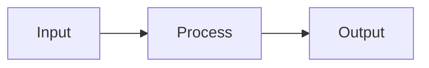
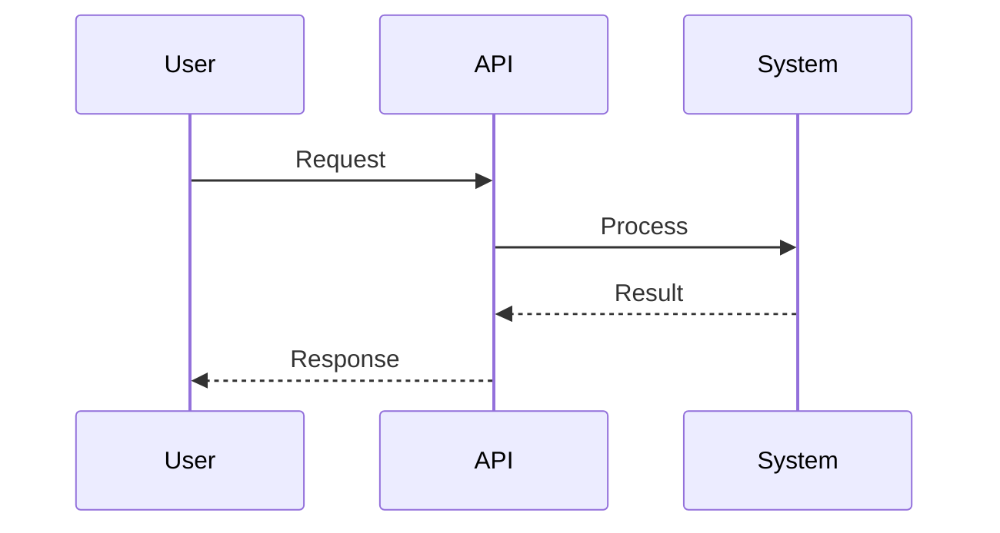
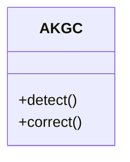

# AKGC Diagrams - Quick Reference

## 🎯 Choose Your Diagram

### Need to show...

#### **Overall System Structure?**
→ Use: [System Architecture](01_system_architecture.md)
- PlantUML: Component diagram with all layers
- Mermaid: High-level architecture graph

#### **User Interactions?**
→ Use: [Use Case Diagrams](02_use_case.md)
- Shows actors (User, Developer, Admin)
- Shows use cases (Detect, Correct, Batch, etc.)

#### **Request/Response Flow?**
→ Use: [Sequence Diagrams](03_sequence.md)
- Standard Mode: Full processing with HVI
- Ultra Mode: Fast pattern-matching
- Batch Processing: Multiple texts

#### **Processing Logic?**
→ Use: [Activity Diagrams](04_activity.md)
- Decision trees and branches
- Cache hit/miss handling
- Mode selection logic

#### **Code Structure?**
→ Use: [Class Diagrams](05_class.md)
- Class hierarchy and relationships
- Methods and attributes
- Data models

#### **Deployment Setup?**
→ Use: [System Design](06_system_design.md)
- Multi-instance deployment
- Load balancing
- Scalability architecture

## 📊 Diagram Cheat Sheet

### PlantUML Quick Syntax

```plantuml
' Components
[Component Name]
package "Package" {}
node "Node" {}
database "DB" {}
cloud "Cloud" {}

' Relationships
A --> B : label
A ..> B : <<include>>
A <|-- B : inheritance
A *-- B : composition

' Actors
actor "User"

' Use Cases
usecase "Use Case"

' Sequence
participant "Name"
A -> B : message
activate A
deactivate A
```

### Mermaid Quick Syntax

```mermaid
' Flowchart
graph TD
    A[Rectangle] --> B{Diamond}
    B -->|Yes| C[Result]
    B -->|No| D[Other]

' Sequence
sequenceDiagram
    A->>B: Message
    B-->>A: Response

' Class
classDiagram
    class ClassName {
        +attribute
        +method()
    }
    Parent <|-- Child

' State
stateDiagram-v2
    [*] --> State1
    State1 --> State2
```

## 🎨 Color Coding

| Color | Hex | Usage |
|-------|-----|-------|
| 🔴 Red | #e74c3c | API, External interfaces |
| 🔵 Blue | #3498db | Core components |
| 🟢 Green | #2ecc71 | Knowledge graph, Data |
| 🟠 Orange | #f39c12 | Utilities, Helpers |

## 📐 Common Patterns

### Standard Processing Flow
```
Input → Extract → Analyze → KG → HVI → Correct → Output
```

### Ultra Processing Flow
```
Input → Pattern Match → Cache → Fast Correct → Output
```

### API Request Flow
```
Client → API → Validator → Mode → Processing → Response
```

## 🔧 Rendering Tools

### Online (No Installation)
- **PlantUML**: http://www.plantuml.com/plantuml/
- **Mermaid**: https://mermaid.live/

### VS Code Extensions
```bash
# PlantUML
code --install-extension jebbs.plantuml

# Mermaid
code --install-extension bierner.markdown-mermaid
```

### Command Line
```bash
# PlantUML
brew install plantuml
plantuml diagram.puml

# Mermaid
npm install -g @mermaid-js/mermaid-cli
mmdc -i diagram.mmd -o diagram.png
```

## 📝 Export Formats

### PlantUML
- PNG: `plantuml -tpng diagram.puml`
- SVG: `plantuml -tsvg diagram.puml`
- PDF: `plantuml -tpdf diagram.puml`

### Mermaid
- PNG: `mmdc -i diagram.mmd -o diagram.png`
- SVG: `mmdc -i diagram.mmd -o diagram.svg`
- PDF: `mmdc -i diagram.mmd -o diagram.pdf`

## 🎯 Use Cases by Audience

### For Developers
- Class Diagrams (code structure)
- Sequence Diagrams (API flows)
- Activity Diagrams (logic)

### For Architects
- System Architecture (components)
- Deployment Diagrams (infrastructure)
- Component Interaction (dependencies)

### For Stakeholders
- Use Case Diagrams (features)
- High-level Architecture (overview)
- Data Flow (processing)

### For Papers/Publications
- System Architecture (PlantUML)
- Sequence Diagrams (detailed flows)
- Performance Comparisons (custom)

## 🚀 Quick Examples

### Simple Component Diagram


### Simple Sequence


### Simple Class


## 📚 Learn More

- Full diagrams: [README.md](README.md)
- PlantUML guide: https://plantuml.com/guide
- Mermaid guide: https://mermaid-js.github.io/mermaid/

---

**Tip**: Start with Mermaid for quick diagrams, use PlantUML for detailed technical documentation.
